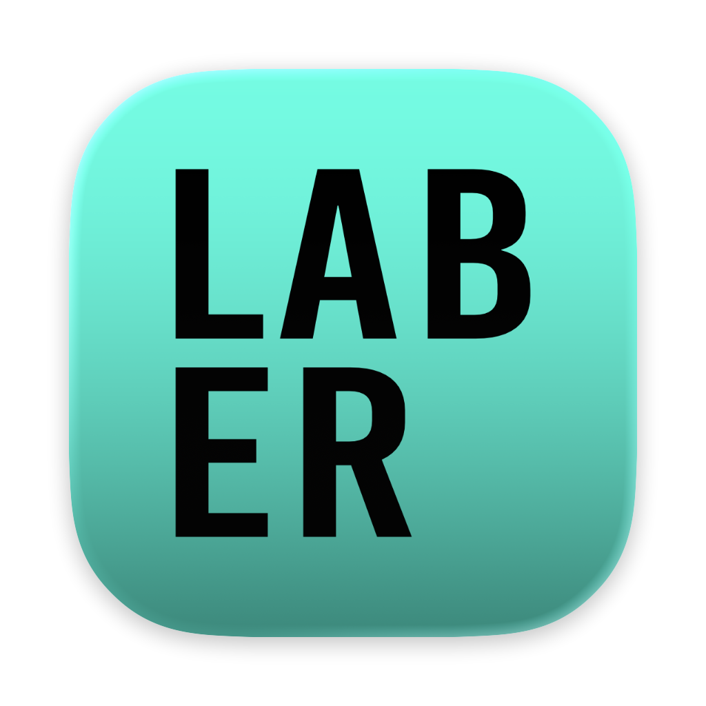
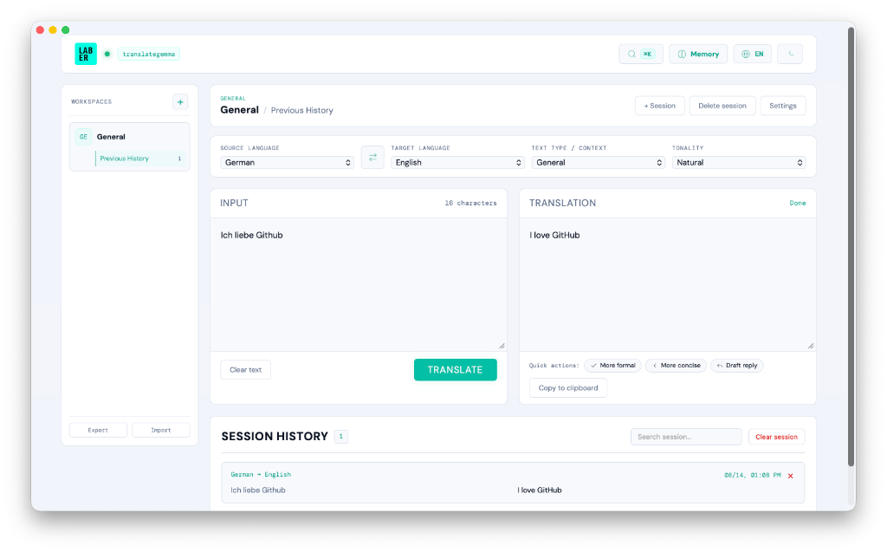

<p align="center">
  
</p>

<h1 align="center">Laber</h1>

<p align="center">
  <strong>A private, local-first language workspace for macOS</strong>
</p>

<p align="center">
  
  
  
  
</p>

**Laber** helps you translate, polish, and draft customer communication without sending text to a hosted AI service. It runs as a native macOS app, talks only to a locally running [Ollama](https://ollama.com/) instance, and organizes work by customer, project, and chat.

<p align="center">
  
</p>

## Features

| Area | Included capabilities |
| :--- | :--- |
| **Local AI** | Translation and writing requests run through local Ollama models. There are no accounts, hosted APIs, or telemetry in the app. |
| **Translation** | Automatic source-language detection, explicit source and target languages, contextual translation modes, tone controls, and workspace-specific terminology. |
| **Polish Mode** | Grammar, proofread, concise, formal B2B, and natural rewriting styles. The selected or detected input language is enforced and validated so polishing does not silently translate the text. |
| **Reply Drafts** | Generate a professional reply in the language of the incoming message, or refine an existing result to be more formal or concise. |
| **Customers & Projects** | Create customer, project, or general workspaces. Projects can be assigned to a customer while keeping their own defaults and terminology. |
| **Chats & Context** | Keep separate searchable chats per workspace. Optional context reuses only the last three turns and is disabled by default. |
| **Draft Recovery** | Unfinished input, output, and the active mode are saved independently for every chat. |
| **Workspace Memory** | Add terminology rules for brand names, product terms, greetings, and preferred translations. |
| **Local Persistence** | Customers, projects, chats, entries, drafts, settings, and terminology are stored in a normalized SQLite database with atomic transactions. |
| **Import & Export** | Export a complete, versioned JSON backup and restore both current and legacy Laber backup formats. |
| **Text Input** | Paste from the clipboard or load text-based files by picker and drag and drop (`.txt`, `.md`, `.json`, `.csv`, `.srt`, `.html`, `.js`, `.py`). |
| **Workflow** | `Cmd+K` quick switcher, menu bar access, optional background mode, automatic processing after paste, and cancellation of superseded requests. |
| **Interface** | German and English UI, dark and light themes, keyboard-accessible dialogs, and right-to-left text support for Persian. |

### Supported languages

The current language selectors include:

- German
- English
- Persian (Farsi)
- French
- Spanish

The native macOS app uses `NLLanguageRecognizer` for local source-language detection. Browser development uses a lightweight fallback detector for the same five languages.

## Privacy and local data

Laber has no analytics, tracking, user accounts, or cloud synchronization. During normal use, text is sent only to the Ollama API on `http://localhost:11434`.
The application Content Security Policy restricts network connections to that local Ollama endpoint.

The native app stores its database at:

```text
~/Library/Application Support/Laber/laber.sqlite3
```

Existing WebKit data is migrated automatically when the native SQLite database is empty. Browser-based development continues to use browser storage as a fallback. JSON backups are intentionally human-readable and may contain customer text, so handle exported files accordingly.

An internet connection is needed to install Ollama and download models. Once those dependencies are available locally, Laber does not require internet access for its core workflows.

## Architecture

| Component | Technology |
| :--- | :--- |
| **Native shell** | Swift, AppKit, `WKWebView` |
| **Language detection** | Apple Natural Language framework |
| **User interface** | HTML, CSS, Vanilla JavaScript |
| **Persistence** | SQLite 3, WAL mode, relational tables, atomic writes |
| **AI runtime** | Ollama with independently configurable translation and writing models |

The WebKit interface communicates with Swift through a small native bridge for SQLite persistence, language detection, menu bar settings, and clipboard actions. No web server is bundled into the app.

## Requirements

- macOS 11 or newer on Apple silicon or Intel
- Apple Command Line Tools or Xcode with `swiftc`
- [Ollama](https://ollama.com/) installed and running
- A local translation model, by default `translategemma:latest`
- A local writing model, by default `gemma3:4b`

Install the default models with:

```bash
ollama pull translategemma:latest
ollama pull gemma3:4b
```

Both model names can be changed in Laber's settings.

## Build from source

```bash
git clone https://github.com/gedankenlust/Laber.git
cd Laber
./scripts/verify.sh
./scripts/build-macos.sh
open dist/Laber.app
```

The build script compiles the Swift shell, copies the local web assets, and applies an ad-hoc signature suitable for local development. It targets macOS 11 by default and builds for the architecture of the current Mac. Set `MACOSX_DEPLOYMENT_TARGET` only when intentionally testing a different minimum version.

To install the local build:

```bash
ditto dist/Laber.app /Applications/Laber.app
```

### Verification

`./scripts/verify.sh` checks:

- JavaScript syntax
- `Info.plist` validity
- whitespace errors
- native Swift compilation
- an isolated SQLite save/load roundtrip
- macOS build-script syntax

## Distribution status

The repository is ready for source publication. It does **not** currently provide an official Developer ID-signed or Apple-notarized binary release. Before distributing downloadable `.app` or `.dmg` files, configure Developer ID signing, notarization, release checksums, and a repeatable release workflow.

## Project layout

```text
.
├── .github/workflows/verify.yml # macOS verification workflow
├── main.swift                 # Native macOS shell and WebKit bridge
├── LaberDatabase.swift        # Relational SQLite persistence
├── index.html                 # Application markup
├── app.js                     # UI, Ollama integration, and application state
├── style.css                  # Application styling
├── Info.plist                 # macOS bundle metadata
├── SECURITY.md                # Private vulnerability-reporting guidance
├── THIRD_PARTY_NOTICES.md     # Notices for bundled third-party assets
├── scripts/
│   ├── build-macos.sh         # Reproducible local app build
│   └── verify.sh              # Dependency-free project checks
└── tests/
    └── SQLiteSmokeTest.swift  # Isolated persistence roundtrip
```

## Contributing

Issues and pull requests are welcome. Please use synthetic example text and never attach real customer communications, exported Laber backups, or local SQLite databases. Run `./scripts/verify.sh` before submitting a change.

## License

Laber source code is available under the [MIT License](LICENSE). Bundled DM Sans and DM Mono font files are distributed under the SIL Open Font License 1.1. Embedded Lucide icons are distributed under the ISC license, with some icons derived from MIT-licensed Feather icons. The required notices are included in [`fonts`](fonts) and [THIRD_PARTY_NOTICES.md](THIRD_PARTY_NOTICES.md).

Ollama and downloaded models are separate dependencies and remain subject to their respective licenses.
